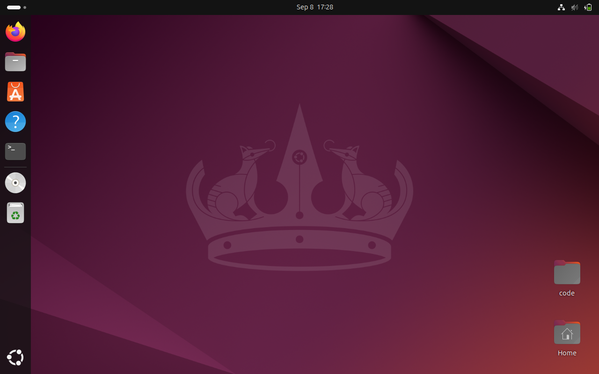
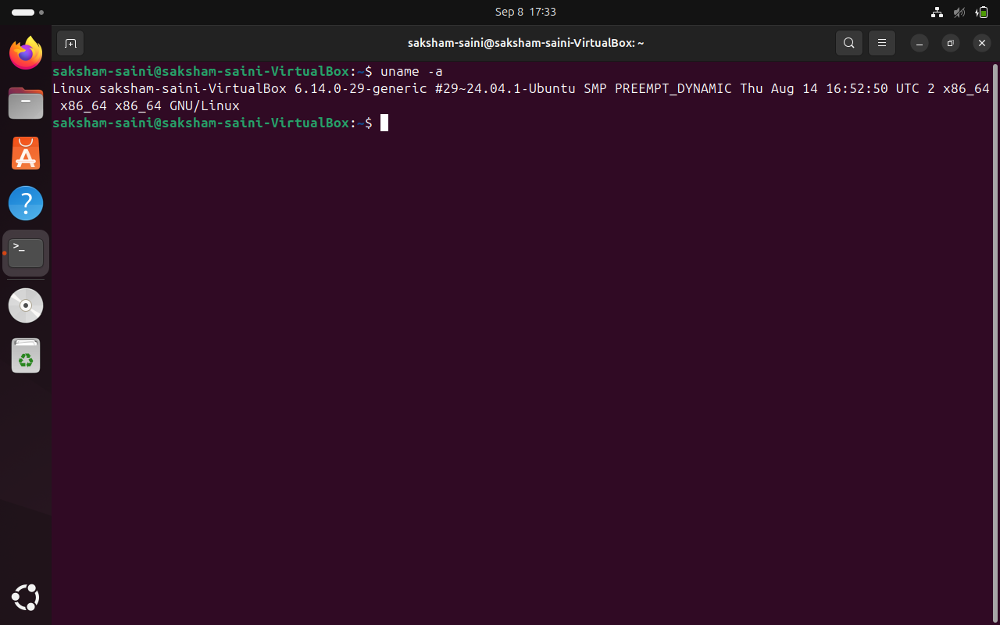
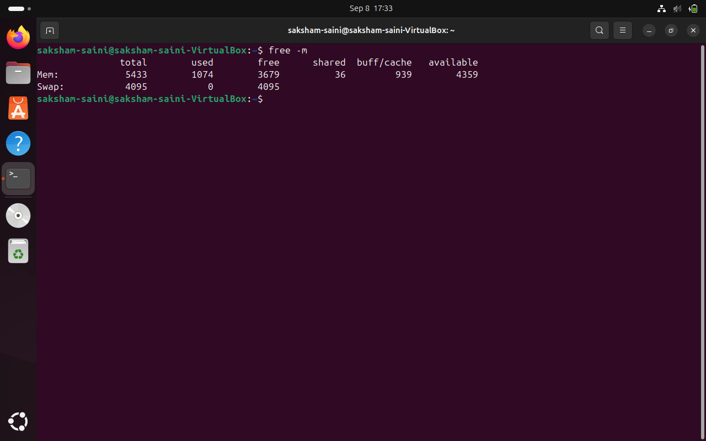

 # 🐧 Linux Lab Assignment - Ubuntu on VirtualBox

## 💻 Installation of Ubuntu on VirtualBox
# 🚀 Option A – Install Ubuntu in a Virtual Machine (VirtualBox)

In this task, I installed **Ubuntu LTS** inside **VirtualBox** instead of using VMware.  
Here’s the complete process I followed 👇

---

## 1️⃣ Install VirtualBox
- First, I downloaded and installed **Oracle VirtualBox** from the official website.  
- VirtualBox provides an easy way to run virtual operating systems.

📸 Screenshot:  


---

## 2️⃣ Download Ubuntu ISO
- I went to the official [Ubuntu Downloads](https://ubuntu.com/download) page.  
- Downloaded the **latest Ubuntu LTS ISO file** (~3 GB).

📸 Screenshot:  


---

## 3️⃣ Create a New VM
- Opened VirtualBox → Clicked on **New**.  
- Named the VM **Ubuntu Desktop**.  
- Selected **Linux → Ubuntu (64-bit)** as the type.  
- Allocated **2 GB RAM** and **20 GB disk** (minimum requirement).

📸 Screenshot:  


---

## 4️⃣ Attach Ubuntu ISO
- Mounted the downloaded ISO file in **Storage → Optical Drive**.  
- This makes VirtualBox boot from the Ubuntu installer.

📸 Screenshot:  


---

## 5️⃣ Install Ubuntu
- Started the VM → Ubuntu installer launched.  
- Selected **Install Ubuntu** option.  
- Followed the on-screen steps: language, keyboard, partition, username, password.  
- After a few minutes, installation completed successfully. 🎉

📸 Screenshot:  


---

## 6️⃣ First Boot
- Restarted the VM.  
- Logged in with my created user account.  
- Ubuntu desktop appeared inside VirtualBox.

📸 Screenshot:  


---


### 🖼️ Screenshot of Ubuntu Desktop


---
```

## 🧪 Basic Linux System Information

I ran the following basic Linux commands in the terminal to get system info.

---

### 📋 1. `lsb_release -a`

**Purpose**: Displays Linux distribution information.

```bash
lsb_release -a
```
📷 Output:
 


```

🖥️ 2. uname -a

Purpose: Shows detailed information about the kernel.

uname -a
```
📷 Output:



```

🧮 3. df -h

Purpose: Displays disk space usage in human-readable format.

df -h
```
📷 Output:


```

🧠 4. free -m

Purpose: Shows memory usage in MB.

free -m
```
📷 Output:



