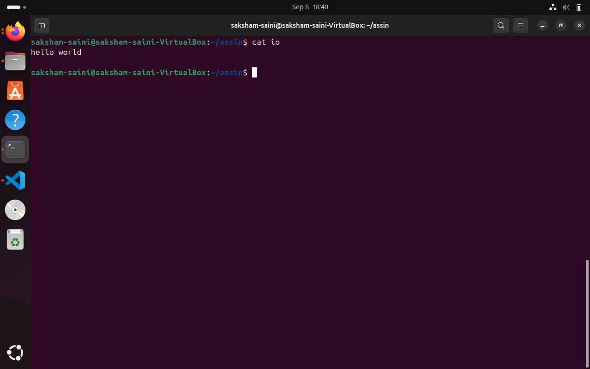
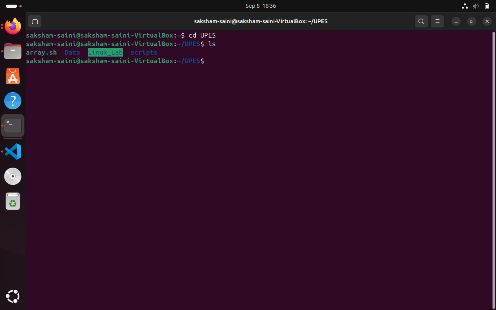
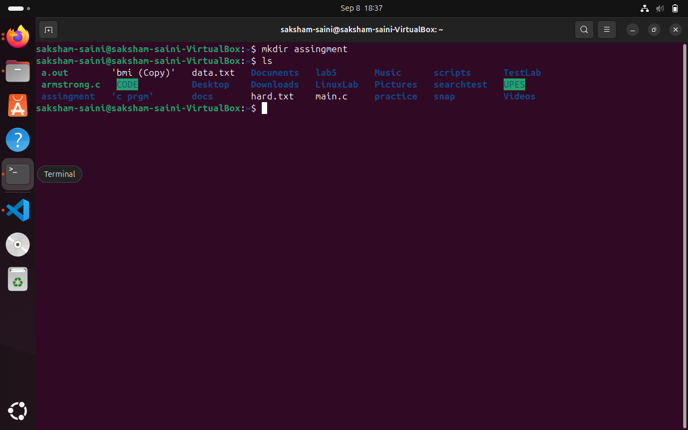
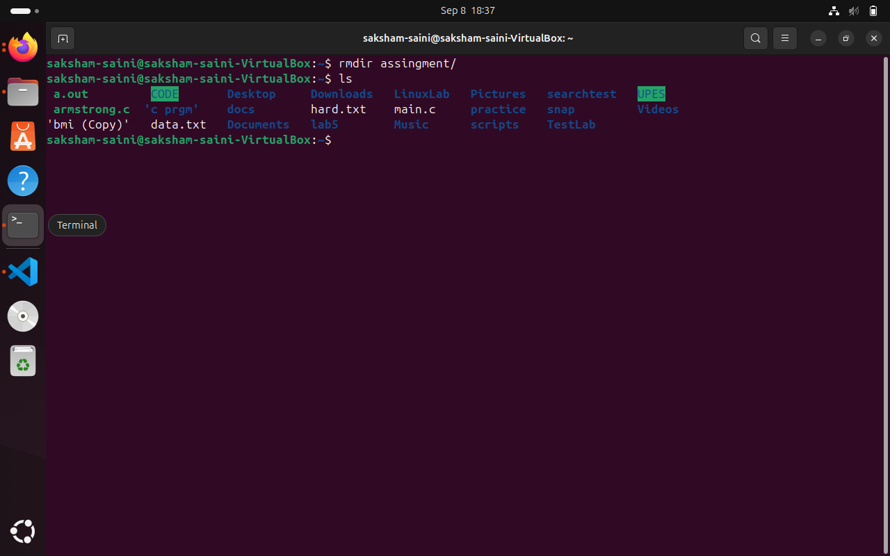
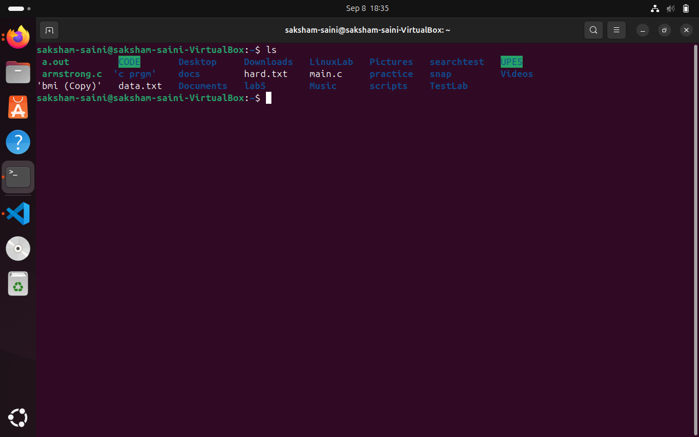
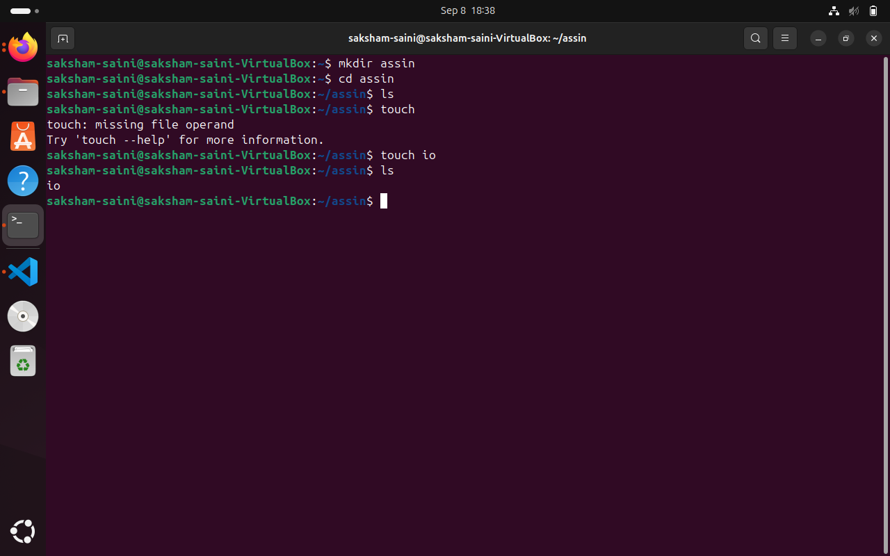

# 🐧 Linux Basic Commands – Quick Guide

Welcome to the **world of Linux**!  
Here are some **powerful yet simple commands** that every beginner must know.  
Each command has a short explanation to make it super easy. 🚀  

---

## 1️⃣ `pwd` – **Print Working Directory**
```bash
pwd

📍 This shows the current directory you are in.
Think of it like asking Linux: "Where am I standing right now?"


---


2️⃣ ls – List Files & Directories

ls

📂 Displays all the files and folders inside the current directory.
It’s like opening a folder in Windows to see what’s inside.


---

3️⃣ cd – Change Directory

cd folder_name

➡️ Used to move between directories.
Example: cd Documents takes you inside the Documents folder.


---

4️⃣ mkdir – Make Directory

mkdir myfolder

🛠️ Creates a new folder.
Perfect for organizing your files into neat compartments.


---

5️⃣ rmdir – Remove Directory

rmdir myfolder

🗑️ Deletes an empty folder.
If the folder has files, Linux won’t remove it directly (safety first!).


---

6️⃣ touch – Create Empty File

touch myfile.txt

📄 Creates a new empty file instantly.
Great for quickly making notes or test files.


---

7️⃣ cat – View File Content

cat myfile.txt

📖 Displays the content of a file directly in the terminal.
It’s like quickly opening a notebook to peek inside.


---

8️⃣ cp – Copy Files

cp source.txt destination.txt

📤 Makes a duplicate of a file.
Handy when you don’t want to lose the original file.


---

9️⃣ rm – Remove Files

rm file.txt

⚠️ Deletes a file permanently.
Be careful—there’s no recycle bin here!



---
🎯 Final Words

Linux is like a superpower tool – these commands are just the beginning.
Mastering them will make you feel like a true terminal wizard 🧙‍♂️!

```







