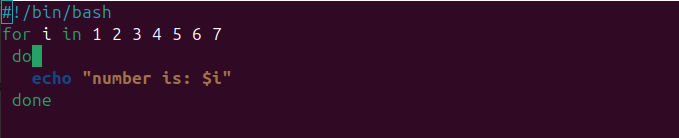
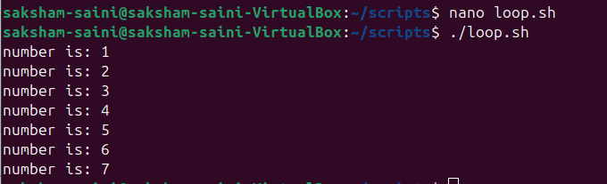
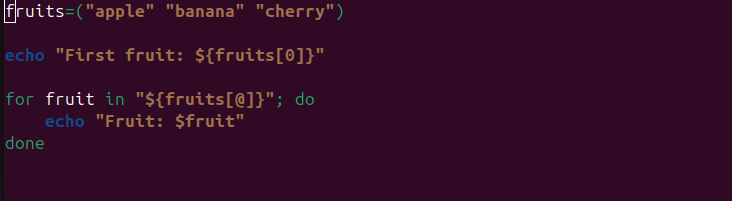
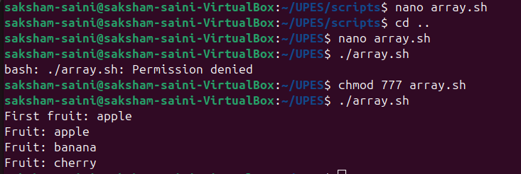

# 🚀 LAB 2 – Exploring Simple Bash Scripts  

In this lab, we will run **two basic shell scripts** from the `Scripts/` folder:  

1. `print_numbers.sh` → Prints numbers in a sequence.  
2. `array_loop.sh` → Demonstrates how arrays and loops work in Bash.  

Both scripts may look small, but they teach us **powerful shell scripting fundamentals** 🐧💻  

---

## 📜 Script 1: `print_numbers.sh`

### 🎯 Purpose
This script prints numbers from **1 to 5** in order.  
It’s a simple example to understand `for` loops in Bash.

---

### 🧩 Code with Explanation

```bash
#!/bin/bash          # 👈 Shebang – tells system to use Bash interpreter

for i in {1..5}      # 👈 Loop from 1 to 5 (Brace Expansion)
do
    echo "Number: $i" # 👈 Print the current value of i
done


---

▶️ Example Run

$ bash print_numbers.sh
Number: 1
Number: 2
Number: 3
Number: 4
Number: 5

✅ As expected, it prints numbers 1 through 5 with a label.


---
```


📜 Script 2: array_loop.sh

🎯 Purpose

This script stores items in an array and prints each one.
It helps us learn how Bash handles collections of values.


---

🧩 Code with Explanation

#!/bin/bash                   # 👈 Use Bash shell

fruits=("Apple" "Banana" "Mango")   # 👈 Define an array with 3 elements

for fruit in "${fruits[@]}"   # 👈 Loop through all array elements
do
    echo "fruit = $fruit"      # 👈 Print each fruit
done


---

▶️ Example Run

$ bash array_loop.sh
fruit =Apple
fruit =Banana
fruit =cherry

🍏🍌🥭 Simple yet powerful! Each array element is processed automatically in the loop.


---


