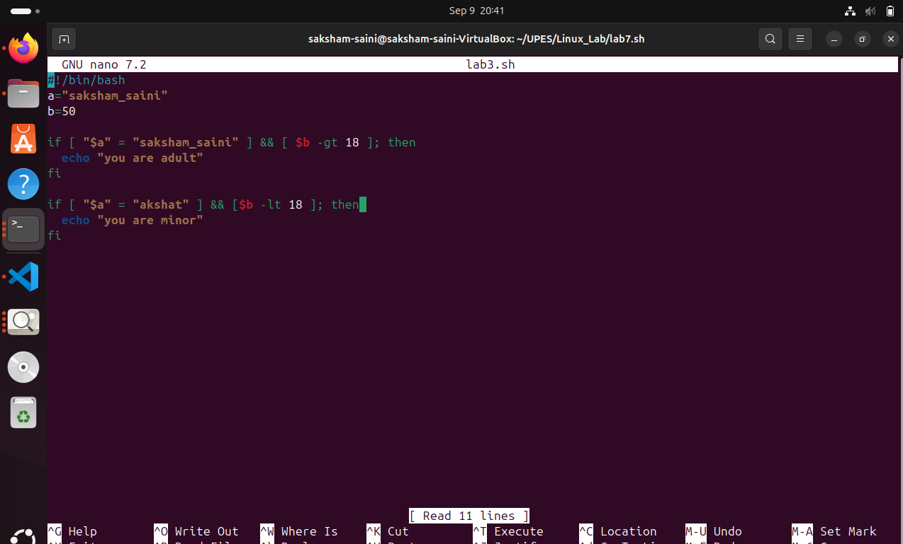
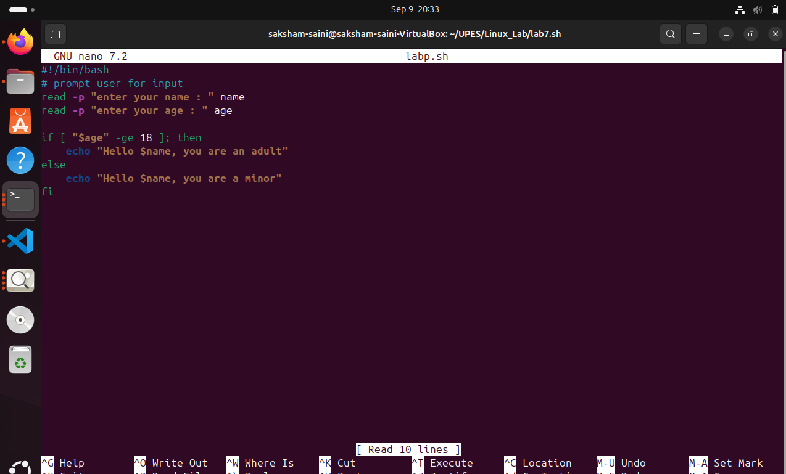
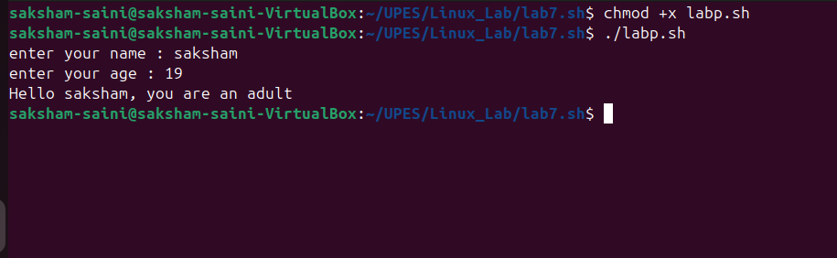

# modifying script

## original script

```
#!/bin/bash        ---shebang
a="saksham saini"           ---taking vansh in the variable a
b=40                 ---taking 40 in the variable b

if [ $a="saksham saini" ] && [ $b -gt 18 ]; then      ---checking conditions and using an opreator and(&&)
    echo " you are adult "                     ---printing you are adult
fi

if [ $a=" akshat" ] && [ $b -lt 18 ]; then       ---checking conditions and using an opreator and(&&)
    echo "you are minor"                         --- printing you are minor
fi

```



##  modified script

```
#!/bin/bash 
# prompt user for input

read -p "enter your name: " name      --- taking name from the user
read -p "enter your age: " age        --- taking age from the user

if [ $name="sehajpreet singh" ] && [ $age -gt 18 ]; then    --- checking conditions with if and opreator and(&&)     
    echo " you are adult "                     --- printing (you are adult)
fi

if [ $name=" akshat" ] && [ $age -lt 18 ]; then  ----  checking conditions with if and opreator and(&&)      
    echo "you are minor"                         ---- printing (you are minor)
fi
```
## the difference between the original and modified script is that in the first one we check for fixed value and in the next case we check for all cases .



## checking with differnt examples
#### output is :


### Q1=differnce between $1,$@ and $# in bash?

Ans-- 0 $1= this refers to positional parameters
         $@= represents all arguments passed to the script
         $#= returns the number of arguments passed

### Q2=what does exit 1 mean in the script
    
Ans-- general error (something went wrong) Or exit with error.