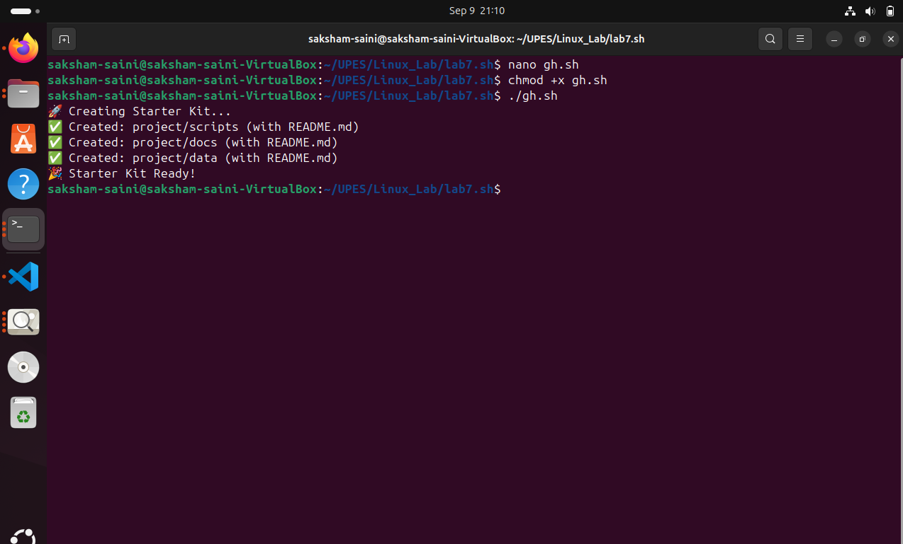
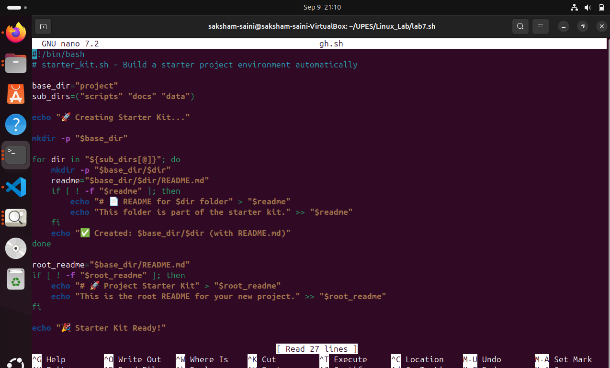
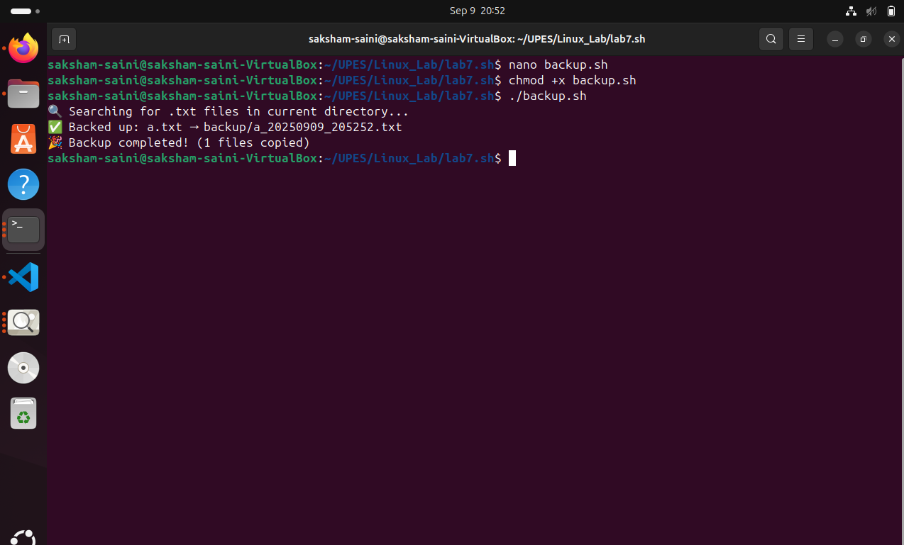
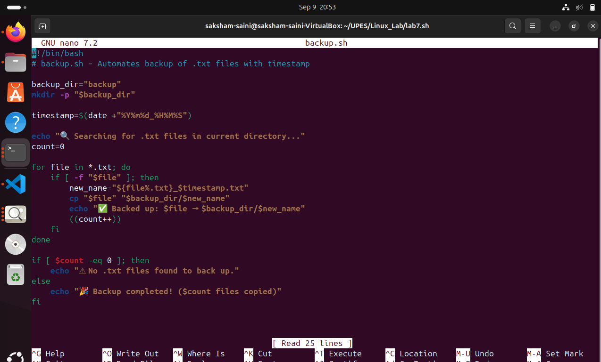
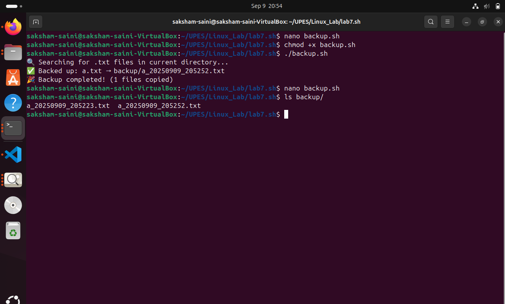

✅ Script: backup.sh

#!/bin/bash
# backup.sh – Automates backup of .txt files with timestamp

# --- Setup Section ---
backup_dir="backup"

# Create backup folder ---

✅ Script: starter_kit.sh

#!/bin/bash
# starter_kit.sh – Build a starter project environment automatically

# --- Setup Section ---
base_dir="project"
sub_dirs=("scripts" "docs" "data")

echo "🚀 Creating Starter Kit..."

# Create main project directory
mkdir -p "$base_dir"

# Create sub-directories with README.md
for dir in "${sub_dirs[@]}"; do
    mkdir -p "$base_dir/$dir"
    readme="$base_dir/$dir/README.md"
    if [ ! -f "$readme" ]; then
        echo "# 📄 README for $dir folder" > "$readme"
        echo "This folder is part of the starter kit." >> "$readme"
    fi
    echo "✅ Created: $base_dir/$dir (with README.md)"
done

# Final README at project root
root_readme="$base_dir/README.md"
if [ ! -f "$root_readme" ]; then
    echo "# 🚀 Project Starter Kit" > "$root_readme"
    echo "This is the root README for your new project." >> "$root_readme"
fi

echo "🎉 Starter Kit Ready!"

🔹 Make it executable:

chmod +x starter_kit.sh


---






```
mkdir -p "$backup_dir"

# --- Timestamp Section ---
timestamp=$(date +"%Y%m%d_%H%M%S")

# --- File Processing Section ---
echo "🔍 Searching for .txt files in current directory..."

count=0
for file in *.txt; do
    if [ -f "$file" ]; then
        new_name="${file%.txt}_$timestamp.txt"
        cp "$file" "$backup_dir/$new_name"
        echo "✅ Backed up: $file → $backup_dir/$new_name"
        ((count++))
    fi
done

# --- Result Section ---
if [ $count -eq 0 ]; then
    echo "⚠ No .txt files found to back up."
else
    echo "🎉 Backup completed! ($count files copied)"
fi

🔹 Don’t forget to give permission:

chmod +x backup.sh


---
-

📘 LAB5.md

# 📂 LAB5 – File & Backup Automation

---

## 🎯 Objective
Automate file management by backing up all `.txt` files in the current directory with **timestamps** in their names.

---

## 🛠 Script: `backup.sh`

### 🔹 How it Works
1. **Create Backup Folder** → If `backup/` does not exist, it is created automatically.  
2. **Generate Timestamp** → Uses `date +"%Y%m%d_%H%M%S"` to ensure unique filenames.  
3. **Find & Copy Files** → Loops through all `.txt` files in the current directory.  
4. **Rename While Copying** → Appends timestamp to each file name before saving in `backup/`.  
5. **Show Results** → Prints messages for each copied file, or warning if no `.txt` found.  

---



## 🖥 Example Run


### ▶ Step 1:Run Script

$ ./backup.sh 🔍 Searching for .txt files in current directory... ✅ Backed up: a.txt → backup/a_20250908_142501.txt ✅ Backed up: notes.txt → backup/notes_20250908_142501.txt ✅ Backed up: lab.txt → backup/lab_20250908_142501.txt 🎉 Backup completed! (3 files copied)

### ▶ Step 3: Check Backup Folder

$ ls backup/ a_20250908_142501.txt notes_20250908_142501.txt lab_20250908_142501.txt

---
```
