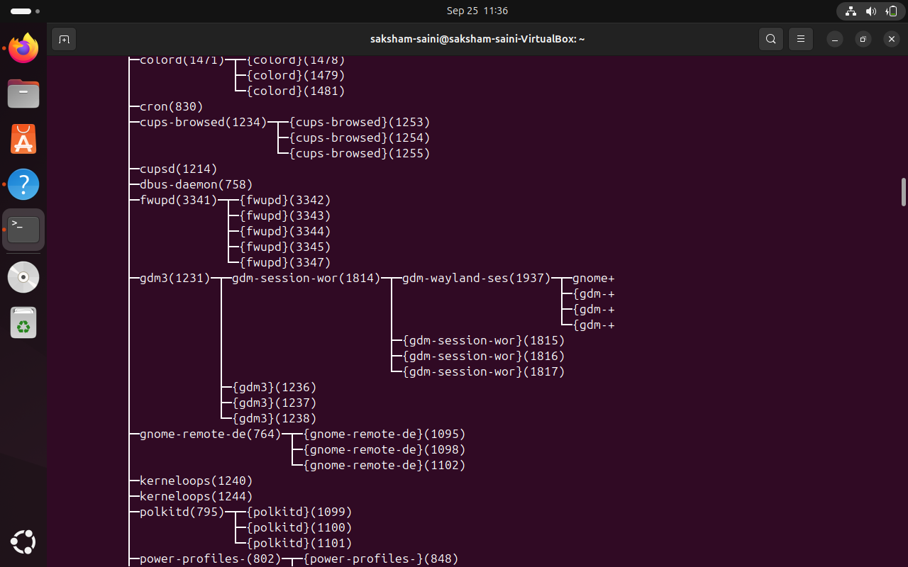
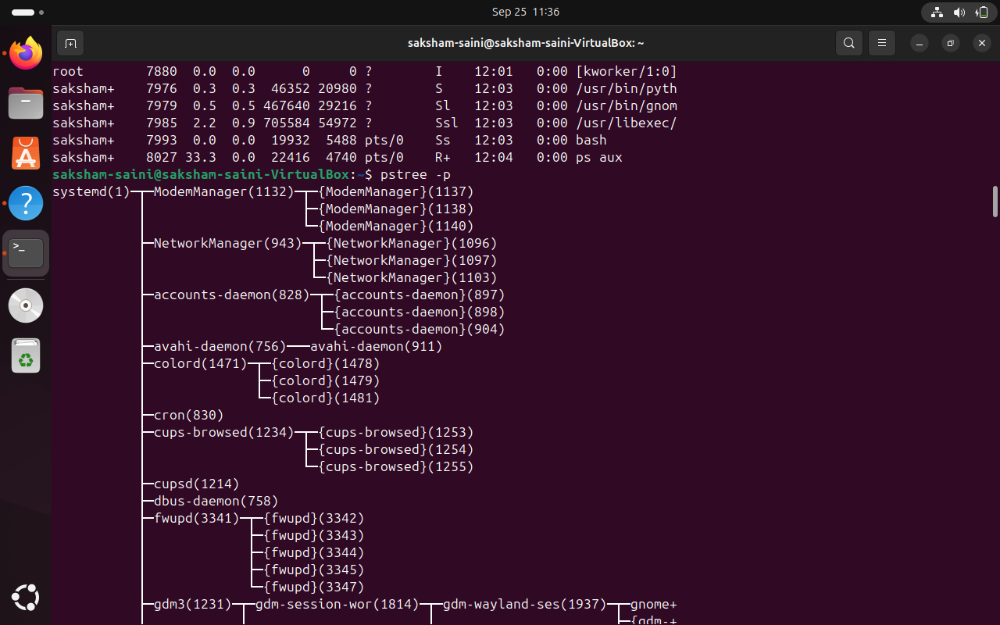
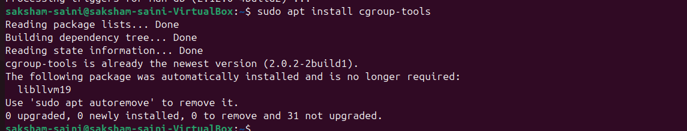
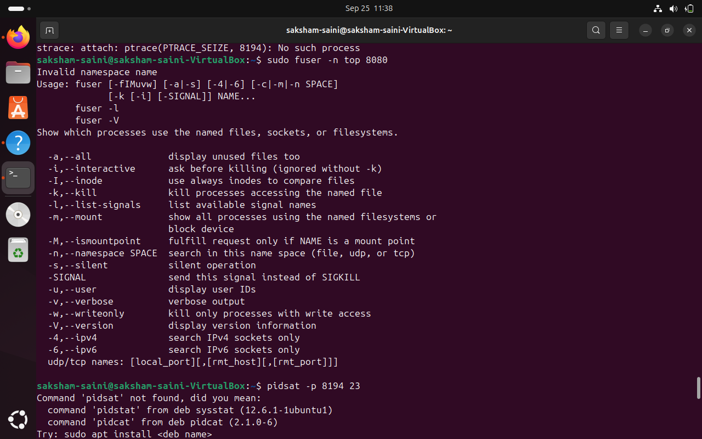
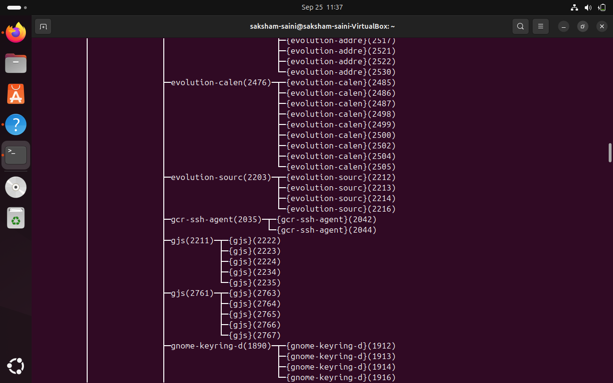
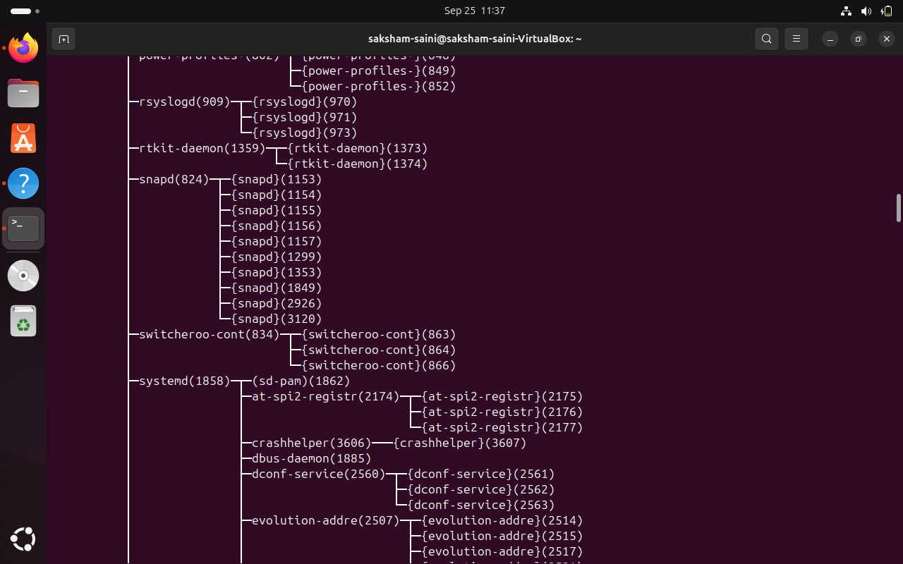
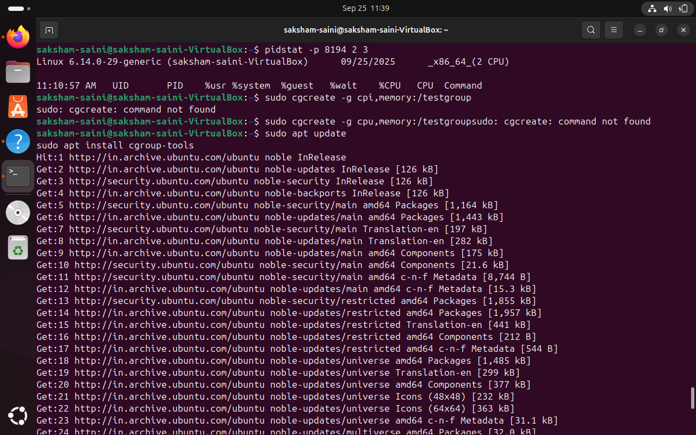
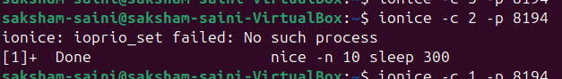

#process_commands
```
1 ps aux

    Shows all processes running on the system.

    Useful for checking what programs are currently running.

🌳 2. View Process Tree (with PIDs)

pstree -p

    Shows the hierarchical tree of processes, with their PIDs (process IDs).

    Helps understand parent-child relationships between processes.

📊 3. Live Process Monitor

top

    Real-time view of processes, their CPU/memory usage, etc.

    Press q to quit.

💤 4. Start a Low Priority Background Process

nice -n 10 sleep 300 &

    Runs sleep 300 with nice value 10 (lower priority).

    The & makes it run in the background.

🔁 5. Change Process Priority (Niceness)

renice -n -5 -p 8194

    Changes the niceness value of process 8194 to -5.

    Higher priority processes have lower (more negative) nice values.

📈 6. CPU Stats for a Process

taskset -cp 8194

    Shows which CPU cores a process is allowed to run on.

    Can be used to bind a process to specific cores.

🧊 7. Set I/O Scheduling Class for a Process

ionice -c 3 -p 8194

    Sets the I/O priority of process 8194 to class 3 (idle).

    The process will only perform I/O when the system is idle.

🔍 8. Show Open Files by a Process

lsof -p 8194 | head -5

    Lists files and ports opened by process 8194.

    head -5 shows only the first 5 lines.

    ⚠️ If you get warnings like:

    lsof: WARNING: can't stat() fuse.gvfsd-fuse...

    → You can safely ignore these. They're related to virtual file systems.

🔦 9. Trace System Calls of a Process

strace -p 8194

    Shows all system calls made by process 8194.

    Useful for debugging and learning how programs interact with the OS.

🔒 10. Find Which Process is Using a Port

sudo fuser -n tcp 8080

    Shows which process is using TCP port 8080.

    Useful when a port is blocked or already in use.

🧩 11. Set Multiple Parent PIDs (Simulated)

pidset -p 8194 2 3

    This command appears incorrect or custom.

    Possibly a typo or refers to a tool not installed by default.

🧠 12. Create a Cgroup for CPU and Memory Control

sudo cgcreate -g cpu,memory:/testgroup

    Creates a control group (cgroup) for resource management.

    ⚠️ If you get the error:

sudo: cgcreate: command not found

→ You need to install it first:

    sudo apt install cgroup-tools

❓ Common Doubts Asked (and Solved)
❓ Why did lsof -p 8194 show warnings?

lsof: WARNING: can't stat() fuse.gvfsd-fuse...

✅ Answer: These are harmless. lsof tried to access some special system folders (used by GNOME/Flatpak apps), but couldn't. You can ignore them or suppress them with:

sudo lsof -p 8194 2>/dev/null | head -5

❓ Why use -9999 in C code for max and secondMax?

✅ Answer: We use -9999 as an initial value because it's very small, so that any number entered by the user (even negative ones) will be larger. It's a safe starting point to compare with.
❓ Why did cgcreate not work?

✅ Answer: If you see:

sudo: cgcreate: command not found

It means the tool isn't installed. Install it using:

sudo apt install cgroup-tools

```
#PRACTICAL_USAEGE












```
#THANK_YOU
```