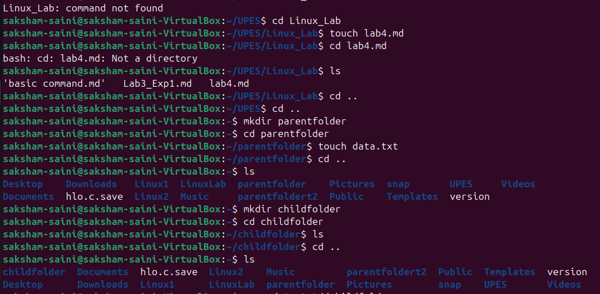
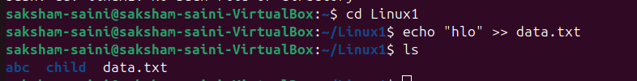
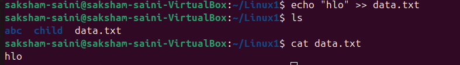
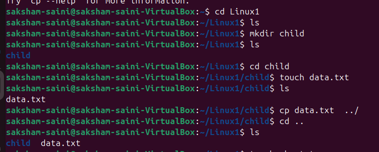

## file transfer


````markdown
# Linux Commands Showcase

This document showcases the usage of basic Linux commands: `cd`, `cp`, `echo`, and `cat`. Each command is explained with an example.

---

## 1. `cd` - Change Directory

The `cd` (Change Directory) command is used to navigate between directories in the file system.

### Syntax:
```bash
cd <directory_path>
````

### Examples:

* **Navigate to a specific directory:**

  ```bash
  cd /home/user/Documents
  ```

* **Move up one directory:**

  ```bash
  cd ..
  ```

* **Navigate to the home directory:**

  ```bash
  cd ~
  ```

* **Navigate to the previous directory:**

  ```bash
  cd -
  ```

---

## 2. `cp` - Copy Files or Directories

The `cp` command is used to copy files or directories from one location to another.

### Syntax:

```bash
cp <source> <destination>
```

### Examples:

* **Copy a file:**

  ```bash
  cp file1.txt /home/user/Documents
  ```

* **Copy a directory and its contents:**

  ```bash
  cp -r my_folder /home/user/Documents
  ```

* **Copy and rename a file:**

  ```bash
  cp file1.txt file2.txt
  ```

---
 

## 3. `echo` - Display Text

The `echo` command is used to display text or output to the terminal.

### Syntax:

```bash
echo <text>
```

### Examples:

* **Display a simple message:**

  ```bash
  echo "Hello, World!"
  ```

* **Display environment variables:**

  ```bash
  echo $HOME
  ```

* **Write text to a file:**

  ```bash
  echo "This is a new file" > newfile.txt
  ```

* **Append text to an existing file:**

  ```bash
  echo "This is additional content" >> existingfile.txt
  ```

---

## 4. `cat` - Concatenate and Display Files

The `cat` command is used to display the contents of a file or concatenate files.

### Syntax:

```bash
cat <file_name>
```

### Examples:

* **Display the contents of a file:**

  ```bash
  cat file1.txt
  ```

* **Concatenate two files and display the output:**

  ```bash
  cat file1.txt file2.txt
  ```

* **Display line numbers along with the file content:**

  ```bash
  cat -n file1.txt
  ```

* **Create a new file using `cat`:**

  ```bash
  cat > newfile.txt
  ```
![][l.png]
---


## transfered a file using all these command 

